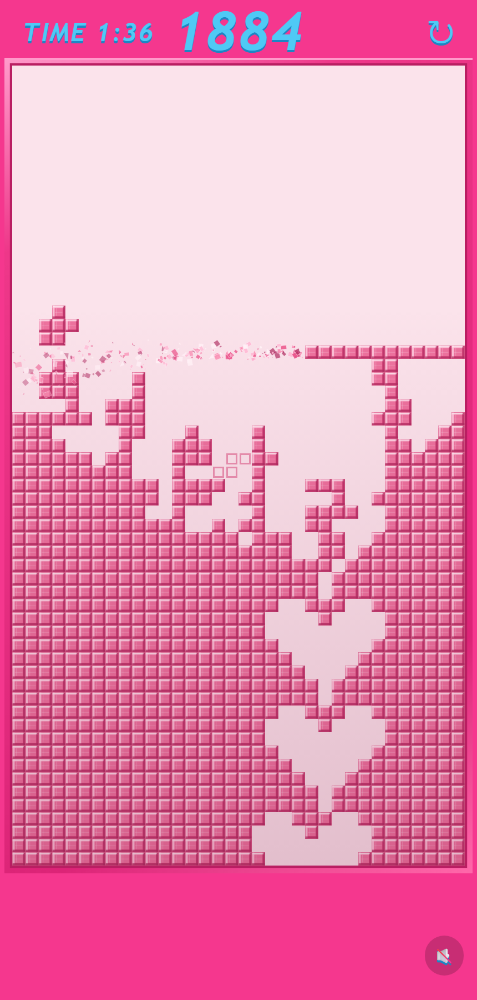

# GlassTerris

粉紅磚牆版的俄羅斯方塊變體。牆會從底部一直往上長，你得靠消行把它削矮。

**▶︎ [直接開來玩](https://arnoldchiou.github.io/GlassTerris/)**（手機直向、桌機都可以）

<p align="center">
  
</p>

---

## 怎麼玩

牆是**滿的**，不是空的。每一列從底部升上來時就預先留好了空格，這些空格連起來會形成一條穿過牆體的通道（簡單關是長直線，困難關是像素愛心）。

你把方塊塞進通道、補滿一整列，那列就會被一道**由左往右掃過去的碎裂波**吃掉，波掃到哪裡分數就加到哪裡。掃完之後整列抽掉、上方的牆往下落——這就是你把牆削矮的方式。

**分數越高，牆升得越快。** 沒有時間限制，唯一的結束條件是牆頂到最上方。所以成績是「撐多久」加上「拿多少分」。

### 操作

| | 手機 | 桌機 |
| :--- | :--- | :--- |
| 左右移動 | 橫向拖曳 | `←` `→` |
| 旋轉 | 點一下 | `↑` 或 `X` |
| 加速下落 | 往下拖 | 按住 `↓` |
| 直接落底 | 往下快甩 | `Space` |

---

## 在本機跑

不用打包、不用安裝相依套件，就是一份靜態網頁。但用了 ES modules，所以要透過 HTTP 開，不能直接雙擊 `index.html`：

```bash
npm run dev     # → http://localhost:8777
npm test        # 34 項玩法邏輯測試
```

網址加 `?debug=1` 會把格子大小、安全區域、fps、上升進度直接印在畫面上。

---

## 這是逆向出來的

玩法不是憑空設計的，是從 IG 上一支 playable ad 的錄影還原的。過程裡用像素自相關量出對方的格子邊長正好 12px，回推場地是 34×60；又靠逐欄比對牆的上緣輪廓，才發現「牆會自己往上長」這個一開始完全沒注意到的核心機制。

規則被實際試玩推翻過八次。**每一條被推翻的規則、以及推翻的理由，都記在 [`docs/玩法規格.md`](docs/玩法規格.md) 第 8 章。** 那份文件也是唯一的規格來源——改玩法之前先讀它，不要憑俄羅斯方塊的直覺回滾任何規則，有幾條看起來「不對」的設計是刻意的。

幾個容易踩的例子：

- 消行**不是**檢查所有滿列。初始牆面本來就有一堆整排實心的列，全掃的話第一顆方塊落地就會把整面牆清光。只有「這一落之後才變滿」的列算數。
- 沒消到列時方塊**完全不動**，架在縫口上也不會掉下去。只有消掉之後，那一塊剩下的磚才會落下。
- 觸控容差用**絕對像素**，不能跟著格子大小縮放。手機上一格只有 10~11px，用格數當容差會讓「想旋轉」變成「方塊往旁邊滑走」。

---

## 結構

```
index.html          版面、安全區域探針、關卡選單
css/style.css
js/config.js        所有影響玩法的數值都在這裡，改動就提版本號
js/board.js         牆面生成、預留空格、升牆、消行、崩塌
js/game.js          主邏輯：碎裂波、落下動畫、升牆節奏
js/render.js        Canvas 2D 繪製
js/input.js         觸控與鍵盤
js/pieces.js        七種方塊與 7-bag
js/particles.js     碎片
js/audio.js         WebAudio 即時合成，沒有音檔
test/logic.test.js  玩法邏輯測試
docs/玩法規格.md     規格書（含被推翻的規則與量測方法）
```

純 Canvas 2D，沒有任何外部相依。
